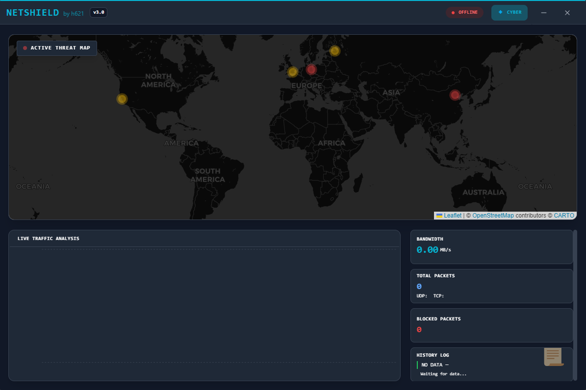

<p align="center">
  
</p>

<h1 align="center">🛡️ NetShield</h1>

<p align="center">
  <strong>Protect your VRChat sessions from network attacks — in real-time.</strong>
</p>

<p align="center">
  <a href="#-english">🇬🇧 English</a> •
  <a href="#-русский">🇷🇺 Русский</a>
</p>

<p align="center">
  
  
  
  
  
</p>

---

# 🇬🇧 English

## The Problem

VRChat players face a real threat: **crashers and DDoS attacks**. These can freeze your game, disconnect you from events, or even expose your IP address. Most solutions require expensive hardware or complex setups.

## The Solution

**NetShield** is a lightweight, open-source shield that runs locally on your PC. It monitors incoming traffic, throttles suspicious connections, and shows you exactly what's happening — all in a beautiful real-time dashboard.

### ✨ What You Actually Get

| Feature | What It Does |
|---------|--------------|
| **🚦 Rate Limiting** | Throttles excessive traffic without blocking legitimate connections |
| **🧠 ML Detection** | Isolation Forest algorithm spots anomalies humans can't catch |
| **🌍 Live Threat Map** | See where attacks originate on a world map |
| **📊 Traffic Analysis** | Real-time charts of your network activity |
| **🕵️ OSINT Profiling** | Automatic IP reputation checks against threat intelligence feeds |
| **🎨 Dual Themes** | Cyber (dark) and Forest (light) — switchable in one click |
| **🌐 Multi-Language** | English, Russian, Kazakh UI |

### 📦 Installation

```powershell
# Clone the repo
git clone https://github.com/vel5id/netshield.git
cd netshield

# Install Python dependencies
pip install pydivert ipwhois pyyaml scikit-learn numpy httpx

# Install GUI dependencies
cd gui
npm install
cd ..
```

### 🚀 Launch (Admin Required)

**Option 1: Backend + GUI separately**
```powershell
# Terminal 1: Backend (as Admin)
python -m netshield

# Terminal 2: GUI
cd gui && npm run dev
```

**Option 2: All-in-One Launcher**
```powershell
python launcher.py
```

### 🔒 How It Works

1. **Intercepts** all VRChat UDP/TCP traffic via WinDivert
2. **Profiles** each IP using real-time WHOIS + threat feeds (IPsum, EmergingThreats, Feodo)
3. **Scores** threats 0-100 based on: country, speed, behavior, known bad actors
4. **Throttles** dangerous traffic (doesn't block — so you don't lose legitimate players)
5. **Visualizes** everything in a sleek Electron dashboard

### 🎯 Threat Scoring

| Factor | Points | Why |
|--------|--------|-----|
| High-risk country | +30 | Historical attack origins |
| Speed > 100 MB/s | +40 | Flood attack signature |
| High throttle ratio | +20 | Persistent excess traffic |
| Hosting/VPN ASN | +15 | Anonymization attempt |
| Known malicious IP | +25 | Confirmed threat intelligence |

### 📁 Log Output

| File | Purpose |
|------|---------|
| `traffic.csv` | Every connection (for analysis) |
| `events.jsonl` | Threat events with HMAC integrity |
| `watchlist.json` | High-score IPs for review |
| `session_*.md` | OSINT report with top offenders |

---

# 🇷🇺 Русский

## Проблема

Игроки VRChat сталкиваются с реальной угрозой: **крашеры и DDoS-атаки**. Они могут заморозить вашу игру, выкинуть с ивента или раскрыть ваш IP. Большинство решений требуют дорогого оборудования или сложных настроек.

## Решение

**NetShield** — это легковесный щит с открытым кодом, который работает локально на вашем ПК. Он мониторит входящий трафик, замедляет подозрительные соединения и показывает, что происходит — всё в красивом дашборде реального времени.

### ✨ Что Вы Реально Получаете

| Функция | Что делает |
|---------|------------|
| **🚦 Rate Limiting** | Замедляет чрезмерный трафик, не блокируя легитимные соединения |
| **🧠 ML-Детекция** | Isolation Forest находит аномалии, которые человек не заметит |
| **🌍 Карта Угроз** | Смотрите на карте мира, откуда идут атаки |
| **📊 Анализ Трафика** | Графики сетевой активности в реальном времени |
| **🕵️ OSINT-Профилирование** | Автоматическая проверка IP по базам угроз |
| **🎨 Две Темы** | Кибер (тёмная) и Лес (светлая) — переключаются одним кликом |
| **🌐 Локализация** | Английский, Русский, Казахский интерфейс |

### 📦 Установка

```powershell
# Клонируем репозиторий
git clone https://github.com/vel5id/netshield.git
cd netshield

# Устанавливаем Python-зависимости
pip install pydivert ipwhois pyyaml scikit-learn numpy httpx

# Устанавливаем зависимости GUI
cd gui
npm install
cd ..
```

### 🚀 Запуск (Нужны права Администратора)

**Вариант 1: Backend + GUI раздельно**
```powershell
# Терминал 1: Backend (от Админа)
python -m netshield

# Терминал 2: GUI
cd gui && npm run dev
```

**Вариант 2: Всё-в-Одном**
```powershell
python launcher.py
```

### 🔒 Как Это Работает

1. **Перехватывает** весь UDP/TCP трафик VRChat через WinDivert
2. **Профилирует** каждый IP через WHOIS + фиды угроз (IPsum, EmergingThreats, Feodo)
3. **Оценивает** угрозы 0-100: страна, скорость, поведение, известные злоумышленники
4. **Замедляет** опасный трафик (не блокирует — чтобы не потерять легитимных игроков)
5. **Визуализирует** всё в стильном Electron-дашборде

### 🎯 Система Оценки Угроз

| Фактор | Баллы | Почему |
|--------|-------|--------|
| Страна высокого риска | +30 | Исторические источники атак |
| Скорость > 100 MB/s | +40 | Сигнатура флуд-атаки |
| Высокий процент throttle | +20 | Устойчивый избыточный трафик |
| Хостинг/VPN ASN | +15 | Попытка анонимизации |
| Известный вредоносный IP | +25 | Подтверждённая разведка |

### 📁 Выходные Файлы

| Файл | Назначение |
|------|------------|
| `traffic.csv` | Каждое соединение (для анализа) |
| `events.jsonl` | События угроз с HMAC-целостностью |
| `watchlist.json` | IP с высоким скором для проверки |
| `session_*.md` | OSINT-отчёт с топ-нарушителями |

---

<p align="center">
  <strong>Made with ❤️ by h621</strong><br>
  <sub>MIT License • Windows Only • Open Source</sub>
</p>
